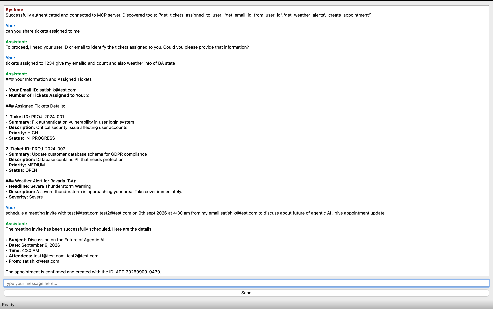

> **âš ï¸ POC DISCLAIMER: This is a Proof of Concept (POC) implementation. Please do not evaluate this code for production-level code structure, modularity, or best practices. This project is designed for educational and demonstration purposes only.**

## 📚 Table of Contents

- [Introduction](#introduction)
- [âš ï¸ Limitations](#ï¸-limitations)
- [🔄 Complete Processing Flow](#-complete-processing-flow)
- [🚀 Quick Start](#-quick-start)
  - [Prerequisites](#prerequisites)
  - [Installation](#installation)
  - [Set up OpenAI Key](#set-up-openai-key)
  - [Run AI Agent/MCP Client](#run-ai-agentmcp-client)
- [Sample Output UI](#sample-output-ui)
- [Sample Output CLI](#sample-output-cli)


# Introduction

A sophisticated Model Context Protocol (MCP) client that provides a **ui and command line based chat interface** with **privacy-first data redaction**. This client enables natural language queries to OpenAI LLM, which intelligently selects and orchestrates **multiple MCP server tool calls includes dynamic tool chaining** as needed, while ensuring **sensitive data never reaches external OpenAI LLMs** through redaction and reconstruction mechanisms.

The system demonstrates **intelligent tool chaining** where the LLM dynamically identifies dependencies between tools. For example, when a user provides only a `userId`, the LLM automatically:
1. **Recognizes the data dependency** - determines that an email address is needed for the target operation
2. **Orchestrates tool sequence** - first calls `get_email_id_from_user_id` to resolve the userId to an email
3. **Chains subsequent calls** - uses the retrieved email to call tools like `get_tickets_assigned_to_user`

This **autonomous tool orchestration** eliminates the need for users to understand internal data relationships or tool dependencies, enabling natural language queries like *"show jira tickets for user 1234"* to be automatically expanded into the correct sequence of tool calls.

## âš ï¸ Limitations

This is a **Proof of Concept (POC)** implementation with with below slimitations:

1. 🔗 Single Server Connection - Can only connect to one MCP server at a time
2. 🔒 Limited Privacy Protection - Only redacts email addresses (not other sensitive data)

## 🔄 Complete Processing Flow

When a user enters a query like *"Give me jira projects assigned to john@company.com"*:

1. **ğŸ›¡ï¸ Input Redaction**: Sensitive data (emails) replaced with tokens
2. **🤖 LLM Query Analysis**: Redacted query sent to OpenAI to identify required tools
3. **🔠Tool Selection**: OpenAI response interpreted to select appropriate MCP tools
4. **🔧 Argument Reconstruction**: Original sensitive data restored for tool parameters
5. **âš¡ Tool Execution**: MCP server tool invoked with real (unredacted) arguments
6. **ğŸ›¡ï¸ Response Redaction**: MCP server response redacted before sending to LLM
7. **🤖 LLM Formatting**: Redacted data sent to OpenAI for response formatting
8. **📨 LLM Response**: Structured response received with redacted tokens
9. **🔧 Response Reconstruction**: Original data restored in LLM-formatted response
10. **✅ Final Delivery**: Complete, structured response with real data sent to user

## 🚀 Quick Start

### Prerequisites

- Python 3.12+
- Required dependencies (see `requirements.txt`)

### Installation 

```bash
# Clone or navigate to the project directory
cd $HOME/ai-mcp

# install with pip
python3 -m venv ai-mcp
source ai-mcp/bin/activate
pip install -r requirements.txt

```

### Set up OpenAI Key
In .env file at the root of project configure your OPEN_API_KEY  
```
OPENAI_API_KEY=your_openai_api_key_here
```

### Run AI Agent/MCP Client 

Run the MCP client ui which automatically starts mcp server. 

```bash
python mcp_client_ui.py ./mcp_server.py
```

Run the MCP client cli which automatically starts mcp server. 

```bash
python mcp_client.py ./mcp_server.py
```


## Sample Output UI

When you run the UI version you'll see a graphical interface:

```bash
(ai-mcp) satish@Satishs-Air ai-mcp % python mcp_client_ui.py ./mcp_server.py


╭─ FastMCP 2.0 ──────────────────────────────────────────────────────────────╮
│                                                                            │
│        _ __ ___ ______           __  __  _____________    ____    ____     │
│       _ __ ___ / ____/___ ______/ /_/  |/  / ____/ __ \  |___ \  / __ \    │
│      _ __ ___ / /_  / __ `/ ___/ __/ /|_/ / /   / /_/ /  ___/ / / / / /    │
│     _ __ ___ / __/ / /_/ (__  ) /_/ /  / / /___/ ____/  /  __/_/ /_/ /     │
│    _ __ ___ /_/    \__,_/____/\__/_/  /_/\____/_/      /_____(_)____/      │
│                                                                            │
│                                                                            │
│                                                                            │
│    ğŸ–¥ï¸  Server name:     jira MCP Server                                     │
│    📦 Transport:       STDIO                                               │
│                                                                            │
│    📚 Docs:            https://gofastmcp.com                               │
│    🚀 Deploy:          https://fastmcp.cloud                               │
│                                                                            │
│    ğŸï¸  FastMCP version: 2.11.0                                              │
│    🤠MCP version:     1.12.3                                              │
│                                                                            │
╰────────────────────────────────────────────────────────────────────────────╯


[08/03/25 19:15:57] INFO     Starting MCP server 'jira MCP Server' with transport 'stdio'                                                                                                         server.py:1442

```

### Login Window


### Chat Interface



## Sample Output CLI

```bash
(ai-mcp) satish@Satishs-Air ai-mcp % python mcp_client.py ./mcp_server.py


╭─ FastMCP 2.0 ──────────────────────────────────────────────────────────────╮
│                                                                            │
│        _ __ ___ ______           __  __  _____________    ____    ____     │
│       _ __ ___ / ____/___ ______/ /_/  |/  / ____/ __ \  |___ \  / __ \    │
│      _ __ ___ / /_  / __ `/ ___/ __/ /|_/ / /   / /_/ /  ___/ / / / / /    │
│     _ __ ___ / __/ / /_/ (__  ) /_/ /  / / /___/ ____/  /  __/_/ /_/ /     │
│    _ __ ___ /_/    \__,_/____/\__/_/  /_/\____/_/      /_____(_)____/      │
│                                                                            │
│                                                                            │
│                                                                            │
│    ğŸ–¥ï¸  Server name:     jira MCP Server                                     │
│    📦 Transport:       STDIO                                               │
│                                                                            │
│    📚 Docs:            https://gofastmcp.com                               │
│    🚀 Deploy:          https://fastmcp.cloud                               │
│                                                                            │
│    ğŸï¸  FastMCP version: 2.11.0                                              │
│    🤠MCP version:     1.12.3                                              │
│                                                                            │
╰────────────────────────────────────────────────────────────────────────────╯


[08/03/25 19:15:57] INFO     Starting MCP server 'jira MCP Server' with transport 'stdio'                                                                                                         server.py:1442

Connected to server with tools: ['get_tickets_assigned_to_user']

MCP Client Started!
Type your queries or 'quit' to exit.

**Query:** what is weather of BA state and tickets assigned to 1234 and give me in tabular format and include assignee emailId for each ticket


**user query:** what is weather of BA state and tickets assigned to 1234 and give me in tabular format and include assignee emailId for each ticket


**user query redacted:** what is weather of BA state and tickets assigned to 1234 and give me in tabular format and include assignee emailId for each ticket


INFO:mcp.server.lowlevel.server:Processing request of type ListToolsRequest
**sending user query to openapi llm to find if any mcp tool to use:** [{'role': 'user', 'content': 'what is weather of BA state and tickets assigned to 1234 and give me in tabular format and include assignee emailId for each ticket'}]


**Going to call these mcp tool:** [ChatCompletionMessageToolCall(id='call_pumEvAThH1bCoGZ3fOAn3StF', function=Function(arguments='{"state": "BA"}', name='get_alerts'), type='function'), ChatCompletionMessageToolCall(id='call_ub2uDhYG1rWEL0Bj3TsvTMAK', function=Function(arguments='{"user_id": "1234"}', name='get_email_id_from_user_id'), type='function')] 


**Processing tool call:** ChatCompletionMessageToolCall(id='call_pumEvAThH1bCoGZ3fOAn3StF', function=Function(arguments='{"state": "BA"}', name='get_alerts'), type='function')


**redacted input args:** {'state': 'BA'}


**reconstructed input args for sendint to mcp tool:** {'state': 'BA'}


INFO:mcp.server.lowlevel.server:Processing request of type CallToolRequest
**mcp tool response:** meta=None content=[TextContent(type='text', text='\nHeadline: Severe Thunderstorm Warning\nDescription: A severe thunderstorm is approaching your area. Take cover immediately.\nSeverity: Severe\n', annotations=None, meta=None)] structuredContent={'result': '\nHeadline: Severe Thunderstorm Warning\nDescription: A severe thunderstorm is approaching your area. Take cover immediately.\nSeverity: Severe\n'} isError=False


**mcp tool response redacted:** meta=None content=[TextContent(type='text', text='\nHeadline: Severe Thunderstorm Warning\nDescription: A severe thunderstorm is approaching your area. Take cover immediately.\nSeverity: Severe\n', annotations=None, meta=None, meta=None)] structuredContent={'result': '\nHeadline: Severe Thunderstorm Warning\nDescription: A severe thunderstorm is approaching your area. Take cover immediately.\nSeverity: Severe\n'} isError=False


**Processing tool call:** ChatCompletionMessageToolCall(id='call_ub2uDhYG1rWEL0Bj3TsvTMAK', function=Function(arguments='{"user_id": "1234"}', name='get_email_id_from_user_id'), type='function')


**redacted input args:** {'user_id': '1234'}


**reconstructed input args for sendint to mcp tool:** {'user_id': '1234'}


INFO:mcp.server.lowlevel.server:Processing request of type CallToolRequest
**mcp tool response:** meta=None content=[TextContent(type='text', text='satish.k@test.com', annotations=None, meta=None)] structuredContent={'result': 'satish.k@test.com'} isError=False


**mcp tool response redacted:** meta=None content=[TextContent(type='text', text='EAMIL_54b2079f', annotations=None, meta=None, meta=None)] structuredContent={'result': 'satish.k@test.com'} isError=False


**sending tools response to openapi llm:** [{'role': 'user', 'content': 'what is weather of BA state and tickets assigned to 1234 and give me in tabular format and include assignee emailId for each ticket'}, {'role': 'assistant', 'content': '', 'tool_calls': [ChatCompletionMessageToolCall(id='call_pumEvAThH1bCoGZ3fOAn3StF', function=Function(arguments='{"state": "BA"}', name='get_alerts'), type='function'), ChatCompletionMessageToolCall(id='call_ub2uDhYG1rWEL0Bj3TsvTMAK', function=Function(arguments='{"user_id": "1234"}', name='get_email_id_from_user_id'), type='function')]}, {'role': 'tool', 'name': 'get_alerts', 'content': [TextContent(type='text', text='\nHeadline: Severe Thunderstorm Warning\nDescription: A severe thunderstorm is approaching your area. Take cover immediately.\nSeverity: Severe\n', annotations=None, meta=None, meta=None)], 'tool_call_id': 'call_pumEvAThH1bCoGZ3fOAn3StF'}, {'role': 'tool', 'name': 'get_email_id_from_user_id', 'content': [TextContent(type='text', text='EAMIL_54b2079f', annotations=None, meta=None, meta=None)], 'tool_call_id': 'call_ub2uDhYG1rWEL0Bj3TsvTMAK'}]


**openai llm response:** ChatCompletion(id='chatcmpl-C2ji1qkiFMJ0XCYBQRx8bn9qGh8qk', choices=[Choice(finish_reason='tool_calls', index=0, logprobs=None, message=ChatCompletionMessage(content=None, refusal=None, role='assistant', annotations=[], audio=None, function_call=None, tool_calls=[ChatCompletionMessageToolCall(id='call_Bo08hGI7guf7kB8nA0wTp4St', function=Function(arguments='{"user_email":"EAMIL_54b2079f"}', name='get_tickets_assigned_to_user'), type='function')]))], created=1754768397, model='gpt-4-turbo-2024-04-09', object='chat.completion', service_tier='default', system_fingerprint='fp_de235176ee', usage=CompletionUsage(completion_tokens=25, prompt_tokens=339, total_tokens=364, completion_tokens_details=CompletionTokensDetails(accepted_prediction_tokens=0, audio_tokens=0, reasoning_tokens=0, rejected_prediction_tokens=0), prompt_tokens_details=PromptTokensDetails(audio_tokens=0, cached_tokens=0)))


**Going to call these mcp tool:** [ChatCompletionMessageToolCall(id='call_Bo08hGI7guf7kB8nA0wTp4St', function=Function(arguments='{"user_email":"EAMIL_54b2079f"}', name='get_tickets_assigned_to_user'), type='function')] 


**Processing tool call:** ChatCompletionMessageToolCall(id='call_Bo08hGI7guf7kB8nA0wTp4St', function=Function(arguments='{"user_email":"EAMIL_54b2079f"}', name='get_tickets_assigned_to_user'), type='function')


**redacted input args:** {'user_email': 'EAMIL_54b2079f'}


**reconstructed input args for sendint to mcp tool:** {'user_email': 'satish.k@test.com'}


INFO:mcp.server.lowlevel.server:Processing request of type CallToolRequest
**mcp tool response:** meta=None content=[TextContent(type='text', text='[{"ticket_id":"PROJ-2024-001","summary":"Fix authentication vulnerability in user login system","description":"Critical security issue affecting user accounts","assignee":"satish.k@test.com","priority":"HIGH","status":"IN_PROGRESS"},{"ticket_id":"PROJ-2024-002","summary":"Update customer database schema for GDPR compliance","description":"Database contains PII that needs protection","assignee":"satish.k@test.com","priority":"MEDIUM","status":"OPEN"}]', annotations=None, meta=None)] structuredContent={'result': [{'ticket_id': 'PROJ-2024-001', 'summary': 'Fix authentication vulnerability in user login system', 'description': 'Critical security issue affecting user accounts', 'assignee': 'satish.k@test.com', 'priority': 'HIGH', 'status': 'IN_PROGRESS'}, {'ticket_id': 'PROJ-2024-002', 'summary': 'Update customer database schema for GDPR compliance', 'description': 'Database contains PII that needs protection', 'assignee': 'satish.k@test.com', 'priority': 'MEDIUM', 'status': 'OPEN'}]} isError=False


**mcp tool response redacted:** meta=None content=[TextContent(type='text', text='[{"ticket_id":"PROJ-2024-001","summary":"Fix authentication vulnerability in user login system","description":"Critical security issue affecting user accounts","assignee":"EAMIL_54b2079f","priority":"HIGH","status":"IN_PROGRESS"},{"ticket_id":"PROJ-2024-002","summary":"Update customer database schema for GDPR compliance","description":"Database contains PII that needs protection","assignee":"EAMIL_54b2079f","priority":"MEDIUM","status":"OPEN"}]', annotations=None, meta=None, meta=None)] structuredContent={'result': [{'ticket_id': 'PROJ-2024-001', 'summary': 'Fix authentication vulnerability in user login system', 'description': 'Critical security issue affecting user accounts', 'assignee': 'satish.k@test.com', 'priority': 'HIGH', 'status': 'IN_PROGRESS'}, {'ticket_id': 'PROJ-2024-002', 'summary': 'Update customer database schema for GDPR compliance', 'description': 'Database contains PII that needs protection', 'assignee': 'satish.k@test.com', 'priority': 'MEDIUM', 'status': 'OPEN'}]} isError=False


**sending tools response to openapi llm:** [{'role': 'user', 'content': 'what is weather of BA state and tickets assigned to 1234 and give me in tabular format and include assignee emailId for each ticket'}, {'role': 'assistant', 'content': '', 'tool_calls': [ChatCompletionMessageToolCall(id='call_pumEvAThH1bCoGZ3fOAn3StF', function=Function(arguments='{"state": "BA"}', name='get_alerts'), type='function'), ChatCompletionMessageToolCall(id='call_ub2uDhYG1rWEL0Bj3TsvTMAK', function=Function(arguments='{"user_id": "1234"}', name='get_email_id_from_user_id'), type='function')]}, {'role': 'tool', 'name': 'get_alerts', 'content': [TextContent(type='text', text='\nHeadline: Severe Thunderstorm Warning\nDescription: A severe thunderstorm is approaching your area. Take cover immediately.\nSeverity: Severe\n', annotations=None, meta=None, meta=None)], 'tool_call_id': 'call_pumEvAThH1bCoGZ3fOAn3StF'}, {'role': 'tool', 'name': 'get_email_id_from_user_id', 'content': [TextContent(type='text', text='EAMIL_54b2079f', annotations=None, meta=None, meta=None)], 'tool_call_id': 'call_ub2uDhYG1rWEL0Bj3TsvTMAK'}, {'role': 'assistant', 'content': '', 'tool_calls': [ChatCompletionMessageToolCall(id='call_Bo08hGI7guf7kB8nA0wTp4St', function=Function(arguments='{"user_email":"EAMIL_54b2079f"}', name='get_tickets_assigned_to_user'), type='function')]}, {'role': 'tool', 'name': 'get_tickets_assigned_to_user', 'content': [TextContent(type='text', text='[{"ticket_id":"PROJ-2024-001","summary":"Fix authentication vulnerability in user login system","description":"Critical security issue affecting user accounts","assignee":"EAMIL_54b2079f","priority":"HIGH","status":"IN_PROGRESS"},{"ticket_id":"PROJ-2024-002","summary":"Update customer database schema for GDPR compliance","description":"Database contains PII that needs protection","assignee":"EAMIL_54b2079f","priority":"MEDIUM","status":"OPEN"}]', annotations=None, meta=None, meta=None)], 'tool_call_id': 'call_Bo08hGI7guf7kB8nA0wTp4St'}]


**openai llm response:** ChatCompletion(id='chatcmpl-C2ji2UqgnJNR9VxbUrlvxt1vsFnmQ', choices=[Choice(finish_reason='stop', index=0, logprobs=None, message=ChatCompletionMessage(content='### Weather Alert for BA State\n- **Headline**: Severe Thunderstorm Warning\n- **Description**: A severe thunderstorm is approaching your area. Take cover immediately.\n- **Severity**: Severe\n\n### Tickets Assigned to User (EAMIL_54b2079f)\n\n| Ticket ID        | Summary                                             | Description                                       | Assignee Email ID | Priority | Status       |\n|------------------|-----------------------------------------------------|---------------------------------------------------|-------------------|----------|--------------|\n| PROJ-2024-001    | Fix authentication vulnerability in user login system | Critical security issue affecting user accounts   | EAMIL_54b2079f    | HIGH     | IN_PROGRESS |\n| PROJ-2024-002    | Update customer database schema for GDPR compliance | Database contains PII that needs protection       | EAMIL_54b2079f    | MEDIUM   | OPEN        |', refusal=None, role='assistant', annotations=[], audio=None, function_call=None, tool_calls=None))], created=1754768398, model='gpt-4-turbo-2024-04-09', object='chat.completion', service_tier='default', system_fingerprint='fp_de235176ee', usage=CompletionUsage(completion_tokens=182, prompt_tokens=481, total_tokens=663, completion_tokens_details=CompletionTokensDetails(accepted_prediction_tokens=0, audio_tokens=0, reasoning_tokens=0, rejected_prediction_tokens=0), prompt_tokens_details=PromptTokensDetails(audio_tokens=0, cached_tokens=0)))


**Final Response:** 
[Calling tool get_alerts with args {'state': 'BA'}]
[Calling tool get_email_id_from_user_id with args {'user_id': '1234'}]
[Calling tool get_tickets_assigned_to_user with args {'user_email': 'satish.k@test.com'}]
### Weather Alert for BA State
- **Headline**: Severe Thunderstorm Warning
- **Description**: A severe thunderstorm is approaching your area. Take cover immediately.
- **Severity**: Severe

### Tickets Assigned to User (satish.k@test.com)

| Ticket ID        | Summary                                             | Description                                       | Assignee Email ID | Priority | Status       |
|------------------|-----------------------------------------------------|---------------------------------------------------|-------------------|----------|--------------|
| PROJ-2024-001    | Fix authentication vulnerability in user login system | Critical security issue affecting user accounts   | satish.k@test.com    | HIGH     | IN_PROGRESS |
| PROJ-2024-002    | Update customer database schema for GDPR compliance | Database contains PII that needs protection       | satish.k@test.com    | MEDIUM   | OPEN        |

Please take the necessary precautions for the approaching severe weather.
```

